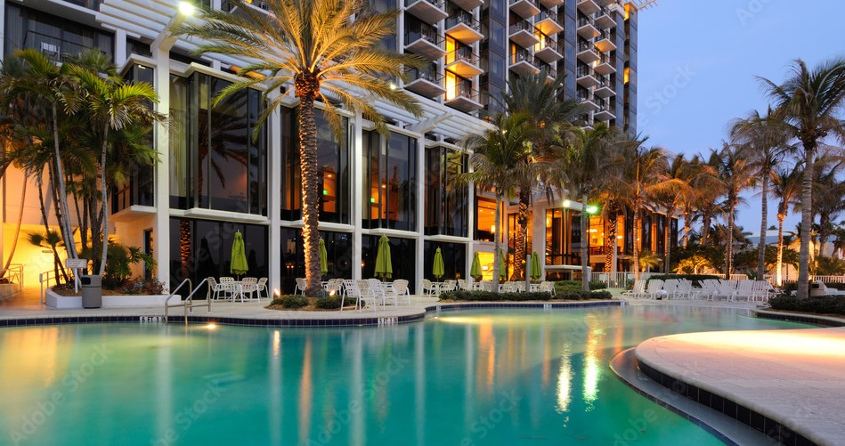
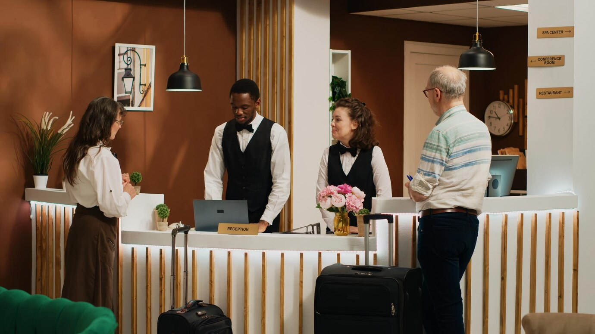

# FutureTale-Hotel-Booking-Cancellation

## Table of Contents
- [Project Overview](#project-overview)
- [Problem Statement](#problem-statement)
- [Project Objective](#project-objective)
- [Data Sources](#data-sources)
- [Data Handling](#data-handling)
- [Data Visualization](#Data-Visualization)
- [Key Insights](#key-insights)
- [Conclusion](#conclusion)

## Project Overview
This project analyzes FutureTale Hotel bookings using Excel to address the rising issue of reservation cancellations. The data revealed a 22% increase in 
cancellations between July 2017 and October 2018, highlighting a significant shift in booking patterns. By leveraging Excel, key factors contributing to this 
trend were identified, offering insights to mitigate future cancellations and improve reservation stability.

## Problem Statement

- High number of cancellations and no-shows as a result of Current cancellation policy that allows free or low-cost cancellations.
- This policy benefits guests but negatively impacts the hotel’s revenue.

## Project Objective
The main objective of this project is to conduct a detailed analysis of hotel reservation data to uncover insights and address the challenges associated 
with rising cancellation rates.

## Data Sources
The dataset used in this project was provided by 10Alytics. The key features are Booking ID, number of adults and children, number of weekend and weeknights, 
meal plan type, car parking requirements, reserved room type, lead time, arrival year and month, market segment, repeated guest status, previous cancellations and bookings, 
booking status, and average price per room.

## Data Handling
Data compilation and cleansing were performed, with duplicate entries identified and removed. A new column, "sum of is_cancelled," was introduced using the 
"IF" function to assign a value of "1" for cancelled bookings and "0" for non-cancelled ones. The VLOOKUP function was applied to derive accurate arrival month names by referencing 
the table containing month numbers and paired them with their corresponding names, ensuring accurate reservation details for FutureTale Hotel.

## EDA/Data Visualization

Following data cleaning, Excel functionalities were utilized for exploratory data analysis to uncover patterns, trends, and anomalies in the reservation data. Data distributions and 
relationships between variables were visualized using charts, graphs, and pivot tables. Cancellation rates were calculated for various periods, market segments, meal plans, and room 
types using Excel formulas. Detailed analyses of market segments, meal plans, and room types were conducted to assess their impact on cancellations. Segmentation analysis was performed 
to generate insights into high-cancellation segments. Booking trends between July 2017 and October 2018 were analyzed, with time series charts created to visualize the progression of bookings, 
cancellations, and redemption rates. Strategic recommendations were developed based on insights generated through Excel to address the identified challenges.

## Key Metrics/Insights
### Overall Booking and Cancellation Analysis
- The analysis showed a total of 36,275 bookings made with 33% cancellatiion, highlighting a high rate of reservation cancellations. On the other hand, 67% of the bookings were successfully redeemed.

### Cancelation trend for the period in view

- In 2017, the hotel recorded a total of 6,514 bookings, with 15% (approximately 977 bookings) cancelled and 85% (approximately 5,537 bookings) redeemed. In 2018, the total bookings
  increased to 29,761, with 37% (approximately 11,026 bookings) cancelled and 63% (approximately 18,735 bookings) redeemed.
- This analysis from 2017 to 2018 revealed an absolute increase of 10,049 cancelled bookings (from 977 in 2017 to 11,026 in 2018) and a corresponding decline in redeemed bookings
  by 13,198 (from 5,537 in 2017 to 18,735 in 2018) at FutureTale Hotel.

### Meal Plan and Room type Impacts
- Cancellation Rate by Meal Plan Type: Meal Plan 1 had the highest number of bookings for both years, while Meal Plan 2 experienced the highest cancellation rate.
- Cancellation Rate by Room Type: Room Type 1 had the most bookings for both years. However, there was a 20% increase in the cancellation rate for Room Type 1 compared to the previous year.

## Conclusion
The examination of FutureTale Hotel booking data reveals critical insights into booking and cancellation trends. The significant rise in cancellation rates between 2017 and 2018 underscores the need 
for targeted strategies to enhance booking stability. By addressing key factors such as meal plans and room types that contribute to cancellations, FutureTale Hotel can implement data-driven improvements 
to optimize guest satisfaction and operational efficiency.

## Recommendation
- Package Deals: Create attractive package deals that include meal plans to enhance the overall value for guests. Offer a range of flexible meal plan options to meet diverse preferences.
- Promotional Campaigns: Initiate targeted promotional campaigns that emphasize the benefits of booking package deals with meal plans. Highlight the added value and convenience to entice more bookings.
- Review Room Type Policies: Reassess the cancellation policies for room types with higher cancellation rates. Adjust these policies to be more accommodating for guests, while maintaining operational viability.
- Dynamic Pricing: Adopt dynamic pricing strategies to adjust room rates based on factors such as demand, seasonality, and booking trends. Offering competitive rates during periods of historically lower cancellations 
  could boost reservations.
- Diversification: Seek opportunities to diversify the guest base by targeting segments with historically lower cancellation rates. Explore partnerships and collaborations to attract more stable clients.
  Tailored marketing and promotional strategies to address high-cancellation segments with personalized offers, loyalty programs, or exclusive deals.

